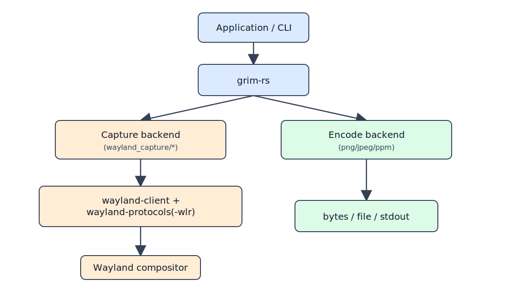
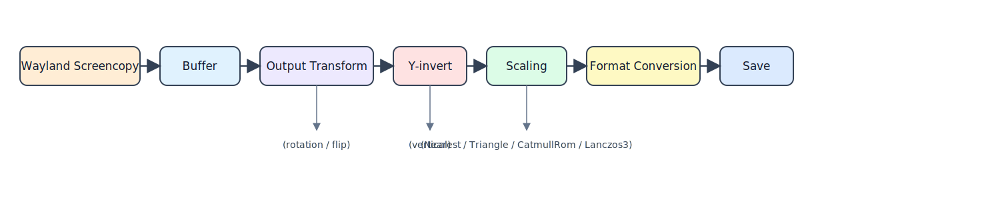

# grim-rs

[](https://crates.io/crates/grim-rs)

> if you like this project, then the best way to express gratitude is to give it a star ⭐, it doesn't cost you anything, but I understand that I'm moving the project in the right direction.

Rust implementation of `grim-rs` screenshot utility for Wayland compositors.

> See [CHANGELOG.md](CHANGELOG.md) for version changes.
> If a release requires migration, it will be documented in [MIGRATION.md](MIGRATION.md) and referenced from the changelog.

## Features

- Pure Rust implementation
- Native Wayland capture via `wl_shm` + `zwlr_screencopy_manager_v1`
- Multi-output capture and compositing
- Full output transform handling (all 8 Wayland transform modes)
- Adaptive image scaling (Nearest / Triangle / CatmullRom / Lanczos3)
- PNG / JPEG / PPM output
- Cursor overlay support (compositor-dependent)
- Y-invert handling for correct orientation
- No external runtime screenshot tools required
- CLI supports XDG Pictures output directory

## Usage

### As a Library

Recommended:

```bash
cargo add grim-rs
```

Or add manually to `Cargo.toml`:

```toml
[dependencies]
grim-rs = "0.1"
```

**MSRV:** Rust 1.68+

**Upgrading?** See [MIGRATION.md](MIGRATION.md) and [CHANGELOG.md](CHANGELOG.md).

### Library Examples

Detailed library examples are in [`doc/library_examples.md`](doc/library_examples.md).

Quick capture example:

```rust,no_run
use grim_rs::Grim;

fn main() -> grim_rs::Result<()> {
    let mut grim = Grim::new()?;
    let result = grim.capture_all()?;
    grim.save_png(result.data(), result.width(), result.height(), "screenshot.png")?;
    Ok(())
}
```

### Command Line Usage

The `grim-rs` binary supports the same functionality as the library API.

Full CLI reference and examples are in [`doc/cli.md`](doc/cli.md).

```bash
# Quick start
cargo run --bin grim-rs

# Capture specific region
cargo run --bin grim-rs -- -g "100,100 800x600" region.png

# Install and run direct binary
cargo install grim-rs
grim-rs -o DP-1 -c monitor.png
```

### Supported Wayland Protocols

- `wl_shm` - Shared memory buffers
- `zwlr_screencopy_manager_v1` - Screenshot capture (wlroots extension)
- `wl_output` - Output information

## API Reference

Use:

- [`doc/api.md`](doc/api.md) for a practical API index.
- [`docs.rs/grim-rs`](https://docs.rs/grim-rs) for complete generated rustdoc.

At a glance:

- Initialize: `Grim::new()`
- Capture: `capture_all*`, `capture_output*`, `capture_region*`, `capture_outputs*`
- Encode/save: `save_png*`, `save_jpeg*`, `save_ppm`, `to_png*`, `to_jpeg*`, `to_ppm`
- Stdout/stderr helpers: `write_png_to_stdout*`, `write_jpeg_to_stdout*`, `write_ppm_to_stdout`
- Utility: `Grim::read_region_from_stdin()`

Feature flags:

- `jpeg` enabled by default (JPEG encode/save/stdout methods).

## Full API Documentation

Comprehensive API documentation is available at [docs.rs](https://docs.rs/grim-rs) or can be generated locally:

```bash
cargo doc --open
```

## Architecture



### Key Components

1. **Grim** - Main interface for taking screenshots
2. **CaptureResult** - Contains screenshot data and dimensions
3. **CaptureParameters** - Parameters for multi-output capture
4. **Buffer** - Shared memory buffer management
5. **Box** - Region and coordinate handling
6. **Output** - Monitor information with transform support
7. **Error** - Comprehensive error handling

### Image Processing Pipeline



### Scaling Quality

Adaptive 4-tier algorithm selection ensures optimal quality/performance balance:

- **Upscaling (scale > 1.0)**: Nearest filter
  - Fastest option for scaling up
  - Preserves hard edges (can look blocky)
  - Example: 1920×1080 → 2560×1440 (1.33×)

- **Mild downscaling (0.75 ≤ scale ≤ 1.0)**: Triangle filter
  - Fast, high-quality for small size reductions
  - Perfect for minor adjustments: 1920×1080 → 1536×864 (0.8×)
- **Moderate downscaling (0.5 ≤ scale < 0.75)**: CatmullRom filter
  - Sharper results than Triangle
  - Better performance than Lanczos3
  - Ideal for medium reduction: 1920×1080 → 1280×720 (0.67×)

- **Heavy downscaling (scale < 0.5)**: Lanczos3 convolution
  - Best quality for significant reduction
  - Ideal for thumbnails: 3840×2160 → 960×540 (0.25×)
  - Superior detail preservation at extreme scales

## Environment Variables

- **`GRIM_DEFAULT_DIR`** - Override default screenshot directory (highest priority)
- **`XDG_PICTURES_DIR`** - XDG Pictures directory (from env or `~/.config/user-dirs.dirs`)

Priority order: `GRIM_DEFAULT_DIR` → `XDG_PICTURES_DIR` (if it exists) → current directory

## Supported Compositors

- ✅ Hyprland
- ✅ Sway
- ✅ River
- ✅ Wayfire
- ✅ Niri
- ✅ Any wlroots-based compositor with `zwlr_screencopy_manager_v1`

## Limitations

- Requires compositor with `zwlr_screencopy_manager_v1` protocol support
- Linux-only (due to shared memory implementation)
- Cursor overlay depends on compositor support

## Building

```bash
cd grim-rs
cargo build --release
```

## Testing

```bash
# Run tests
cargo test
cargo test --all-targets

# Run examples
cargo run --example comprehensive_demo
cargo run --example profile_test
cargo run --example second_monitor_demo
```

## Contributing

See the full contribution guide in [CONTRIBUTING.md](CONTRIBUTING.md).

## License

MIT License - see [LICENSE](./LICENSE) file for details.
