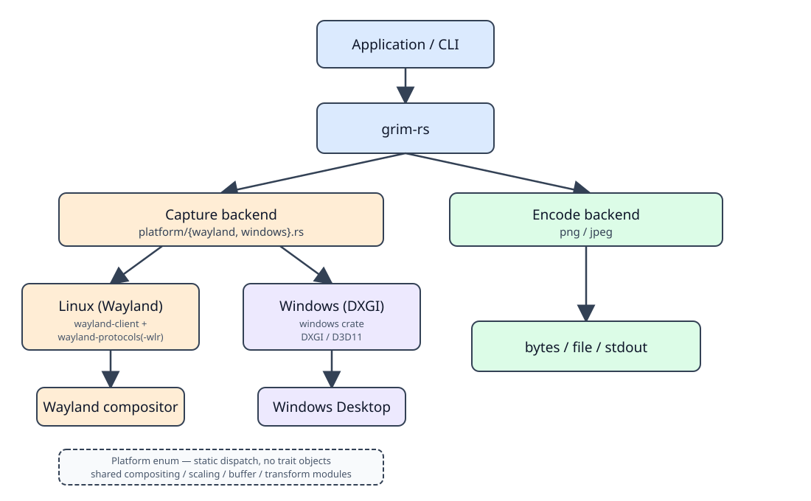
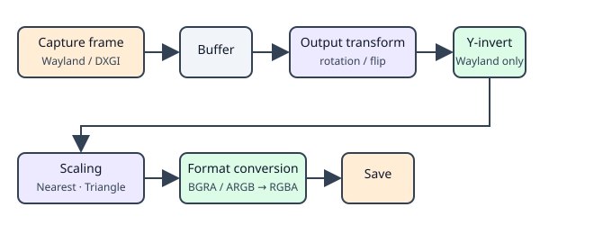

# grim-rs

[](https://crates.io/crates/grim-rs)

> [!IMPORTANT]
> [`CHANGELOG`](CHANGELOG.md) · [`API`](doc/api.md) · [`MIGRATION`](MIGRATION.md) · [`Examples`](doc/library_examples.md)

> if you like this project, then the best way to express gratitude is to give it a star ⭐, it doesn't cost you anything, but I understand that I'm moving the project in the right direction.

___

Rust implementation of `grim` screenshot utility for Wayland compositors and Windows (DXGI Desktop Duplication).

## Features

- Pure Rust implementation
- Cross-platform: same API on Linux (Wayland) and Windows (DXGI)
- Native capture via `ext-image-copy-capture-v1`, `zwlr_screencopy_manager_v1`, or DXGI
- Multi-output capture and compositing
- Adaptive image scaling (Nearest / Triangle / CatmullRom / Lanczos3)
- PNG / JPEG output
- Cursor overlay support
- No external runtime screenshot tools required

## Usage

### As a Library

```bash
cargo add grim-rs
```

```toml
[dependencies]
grim-rs = "0.2"
```

**MSRV:** Rust 1.68+

```rust,no_run
use grim_rs::Grim;

fn main() -> grim_rs::Result<()> {
    let mut grim = Grim::new()?;
    let result = grim.capture_all()?;
    grim.save_png(result.data(), result.width(), result.height(), "screenshot.png")?;
    Ok(())
}
```

### Command Line

```bash
# Quick start
cargo run --bin grim-rs

# Capture specific region
cargo run --bin grim-rs -- -g "100,100 800x600" region.png

# Install and run direct binary
cargo install grim-rs
grim-rs -o DP-1 -c monitor.png
```

Full CLI reference: [`doc/cli.md`](doc/cli.md)

## Architecture



### Processing Pipeline



## Supported Platforms

**Linux (Wayland):** Hyprland, Sway, River, Wayfire, Niri, any wlroots-based compositor

**Windows:** Windows 8+ with DXGI Desktop Duplication support

## Limitations

- **Linux**: Requires compositor with `ext-image-copy-capture-v1` or `zwlr_screencopy_manager_v1`
- **Windows**: `Grim::new_ext()` and `Grim::new_wlr()` return `Error::UnsupportedProtocol` (Wayland-only); protected content (DRM) cannot be captured

## Building

```bash
cargo build --release
```

## Contributing

See [CONTRIBUTING.md](CONTRIBUTING.md).

## License

MIT License - see [LICENSE](./LICENSE) file for details.
